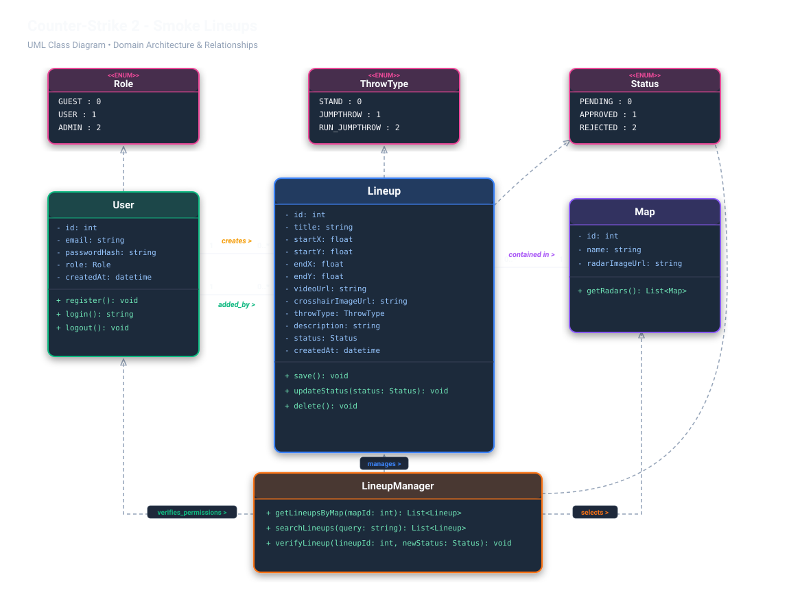
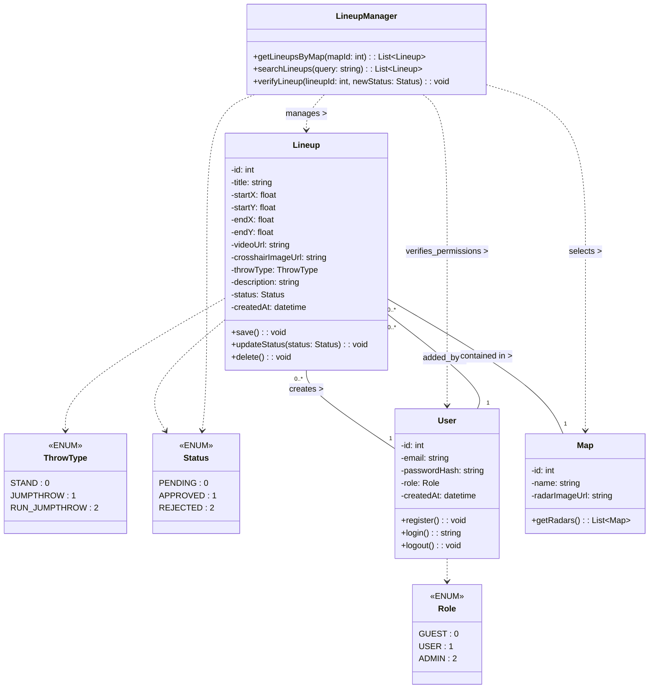

# 🎯 Counter-Strike 2 Smoke Lineups Application

A lightweight, high-performance web application for discovering, viewing, submitting, and moderating tactical grenade smoke lineups on competitive CS2 tournament maps.

Built strictly with **PHP (OOP)**, **JavaScript (Vanilla ES6+)**, **HTML5**, **CSS3**, and **SQL**.



---

## 🚀 Features

- **Interactive Radar Map Canvas**: Visualizes player throw coordinates (`startX`, `startY`) and smoke bloom landing locations (`endX`, `endY`) with curved trajectory paths on official CS2 radar maps (*de_mirage, de_inferno, de_nuke, de_dust2*).
- **Domain-Driven OOP Architecture**: Faithfully implements the whiteboard UML Class Diagram specification.
- **Role-Based Access Control (RBAC)**:
  - **`GUEST` (`0`)**: Search and explore approved lineups without registration.
  - **`USER` (`1`)**: Submit new lineups and manage submissions.
  - **`ADMIN` (`2`)**: Moderation interface with instant approval and rejection workflows.
- **Granular Throw Mechanics**: Classifies throw execution into **`STAND` (`0`)**, **`JUMPTHROW` (`1`)**, and **`RUN_JUMPTHROW` (`2`)**.
- **Real-Time Search & Filtering**: Instant client-side and server-side filtering by map, throw technique, and keywords.
- **Zero-Config Database**: Auto-bootstrapping SQLite database with realistic seed data, with full switch compatibility for MySQL / MariaDB via PDO.

---

## 📊 UML 2.5 Class Diagram



---

## 📁 Repository Structure

```
CS2_Smoke_Lineups_UML/
├── .gitignore                     # Git ignore rules (database, logs, editor configs)
├── README.md                      # Project documentation and setup guide
├── diagram.svg                    # High-resolution vector UML diagram
├── diagram.mmd                    # Mermaid source diagram
├── database/
│   └── schema.sql                 # SQL tables, indexes, constraints, and seed data
├── src/
│   ├── Config/
│   │   └── Database.php           # PDO connection manager (SQLite / MySQL)
│   ├── Enums/
│   │   ├── ThrowType.php          # STAND=0, JUMPTHROW=1, RUN_JUMPTHROW=2
│   │   ├── Role.php               # GUEST=0, USER=1, ADMIN=2
│   │   └── Status.php             # PENDING=0, APPROVED=1, REJECTED=2
│   ├── Models/
│   │   ├── User.php               # User registration, login, session
│   │   ├── Map.php                # Map radar catalog model
│   │   └── Lineup.php             # Smoke lineup domain entity
│   └── Services/
│       └── LineupManager.php      # Search, filter, and moderation service
└── public/
    ├── index.html                 # Tactical CS2 Single Page Application
    ├── api.php                    # REST API router
    ├── css/
    │   └── style.css              # Custom CS2 tactical dark stylesheet
    ├── js/
    │   └── app.js                 # Interactive radar and client-side logic
    └── assets/
        └── radars/                # Vector CS2 radar overviews
```

---

## ⚡ Quick Start

### 1. Requirements
- **PHP 8.1+** (with `pdo` and `pdo_sqlite` or `pdo_mysql` enabled)
- Modern web browser (Chrome, Firefox, Edge, Safari)

### 2. Running Locally (PHP Built-in Server)
Open terminal in the project root directory and run:

```bash
php -S localhost:8000 -t public
```

Then visit:
👉 **http://localhost:8000**

> [!NOTE]
> The SQLite database is automatically generated on the first request from `database/schema.sql`. No manual database configuration is required!

---

## 🔑 Demo Accounts

The database comes pre-seeded with test accounts:

| Role | Email | Password | Permissions |
| :--- | :--- | :--- | :--- |
| **Administrator** | `admin@cs2lineups.com` | `admin123` | Can approve, reject, or verify any lineup |
| **Player / User** | `player1@cs2lineups.com` | `player123` | Can submit new lineups |

---

## 🛠️ REST API Reference

All requests communicate with `public/api.php` via JSON:

| Method | Endpoint | Description |
| :--- | :--- | :--- |
| `GET` | `api.php?action=get_maps` | Returns all tournament maps (`Map::getRadars`). |
| `GET` | `api.php?action=get_lineups&mapId=1` | Returns lineups for a map (`LineupManager::getLineupsByMap`). |
| `GET` | `api.php?action=search_lineups&query=window` | Searches lineups (`LineupManager::searchLineups`). |
| `POST` | `api.php?action=save_lineup` | Submits a new lineup (`Lineup::save`). |
| `POST` | `api.php?action=verify_lineup` | Approves / rejects lineup (`LineupManager::verifyLineup`). |
| `POST` | `api.php?action=login` | Logs in user and returns session token (`User::login`). |
| `POST` | `api.php?action=register` | Registers a new account (`User::register`). |
| `GET` | `api.php?action=logout` | Terminates active session (`User::logout`). |
| `GET` | `api.php?action=session` | Returns current user authentication state. |

---

## 📤 Pushing to GitHub

To push this repository to GitHub, run the following commands in PowerShell or Bash:

```bash
cd "C:\Users\4A\Desktop\CS2_Smoke_Lineups_UML"
git init
git add .
git commit -m "feat: initial release of CS2 Smoke Lineups application"
git branch -M main
git remote add origin https://github.com/YOUR_USERNAME/YOUR_REPOSITORY.git
git push -u origin main
```

---

## 📄 License
MIT License. Free to use for the Counter-Strike 2 gaming and development community.
